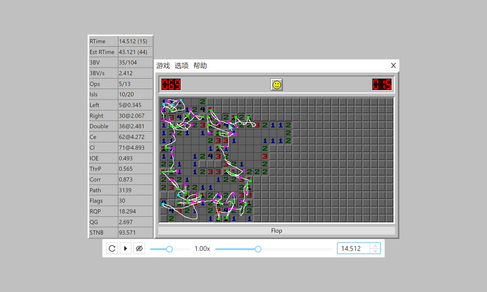
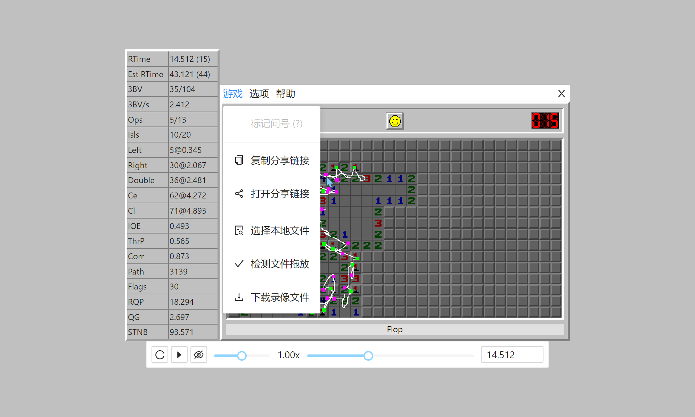
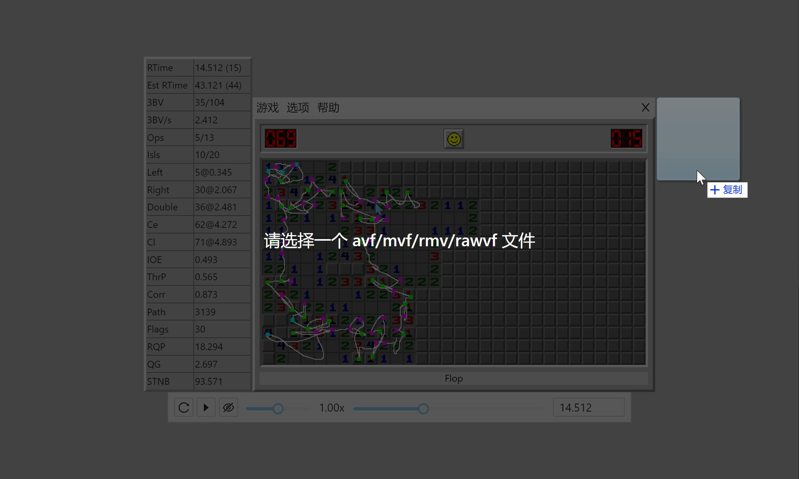

# Flop Player

网页版扫雷录像播放器

## 预览

- 在线预览地址：https://hgraceb.github.io/flop-player/

## 特性

1. 录像地图：可自由控制是否显示鼠标轨迹、点击位置、开空区域
2. 录像控制条：可调节进度条或者输入时间节点，对录像进度进行毫秒级的调整
3. 支持本地录像：将录像文件拖放到当前窗口，可直接对录像进行解析和播放
4. 录像解析：可选择对单个录像文件进行解析，通过回调获取录像的基本信息

## 截图

- 主页

  

- 菜单

  

- 文件拖放

  

## 使用

1. 将 Flop Player 打包后的代码复制到工程目录下

2. 引入样式文件，或者将[样式源码](./public/index.css)直接复制到已有的样式文件中

   ```html
   <link href="index.min.css" rel="stylesheet" type="text/css">
   ```

3. 添加一个 `<iframe>` 标签，指定 `src` 为 `index.html`，并添加一个名为 `flop-player-display-none` 的 `class`，`<iframe>` 的基础布局可以自定义，也可以使用默认提供的 `flop-player-iframe`

   ```html
   <iframe class="flop-player-iframe flop-player-display-none" src="index.html"></iframe>
   ```

4. 等待 Flop Player 加载完成后，可以通过 `window.flop` 调用播放录像和解析录像的接口，Flop Player 的代码文件体积有 1MB 左右，首次加载时可能需要等待一段时间，建议可以开启 `gzip` 压缩优化加载速度

## 接口

### flop.playVideo(uri, options)

播放录像接口，参数说明如下：

| 参数                     | 类型                | 说明                                | 默认值    |
| ------------------------ | ------------------- | ----------------------------------- | --------- |
| uri                      | string              | 录像地址                            | -         |
| options                  | object\|undefined   | 播放参数                            | undefined |
| options.share            | object\|undefined   | 分享链接配置                        | undefined |
| options.share.uri        | string              | 分享链接页面录像地址                | -         |
| options.share.title      | string\|undefined   | 分享链接页面标题                    | undefined |
| options.share.favicon    | string\|undefined   | 分享链接页面图标                    | undefined |
| options.share.pathname   | string\|undefined   | 分享链接页面路径名称，开头有一个"/" | '/'       |
| options.share.background | string\|undefined   | 分享链接页面背景样式                | '#eee'    |
| options.share.anonymous  | boolean\|undefined  | 分享链接页面是否匿名显示玩家名称    | false     |
| options.anonymous        | boolean\|undefined  | 是否匿名显示玩家名称                | false     |
| options.background       | string\|undefined   | 遮罩背景样式                        | ''        |
| options.listener         | function\|undefined | 退出录像播放页面的回调              | () => {}  |

## 关于

- 本工程所有测试录像均来自[扫雷网](https://saolei.wang/)、[Authoritative Minesweeper](https://minesweepergame.com/) 公开资源及个人录像

## 其他

| 名称                                                         | 说明                                                         |
| ------------------------------------------------------------ | ------------------------------------------------------------ |
| [Ant Design Vue](https://2x.antdv.com/components/overview/)  | 🌈 An enterprise-class UI components based on Ant Design and Vue. 🐜 |
| [Minesweeper RAW Video Format](https://github.com/thefinerminer/minesweeper-rawvf) | This project hosts code for converting different videos formats into RAWVF. |
